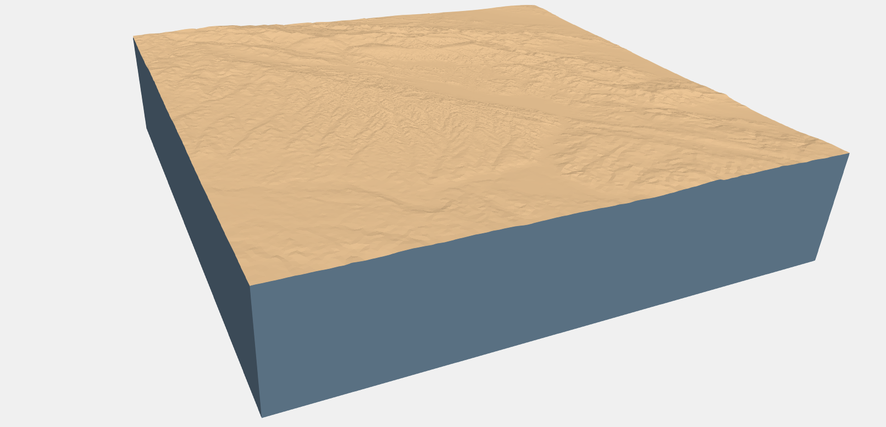
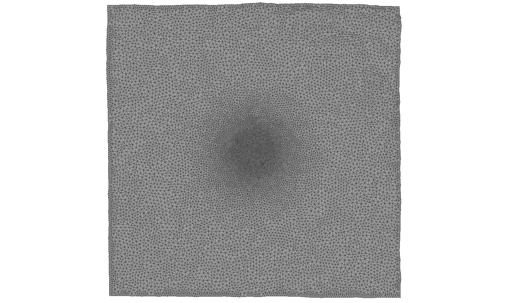

EDGEcut
=========
EDGEcut is a tool for generating surface meshes for a computational domain with topography. It makes
heavy use of the `Computational Geometry Algorithms Library <https://www.cgal.org/>`_ (CGAL), particularly the
`3D Mesh Generation <https://doc.cgal.org/latest/Mesh_3/index.html#Chapter_3D_Mesh_Generation/>`_,
`Polygon Mesh Processing <https://doc.cgal.org/latest/Polygon_mesh_processing/index.html#Chapter_PolygonMeshProcessing/>`_,
and `3D Polyhedral Surface <https://doc.cgal.org/latest/Polyhedron/index.html#Chapter_3D_Polyhedral_Surfaces/>`_ packages.

EDGEcut takes as input a rectangular sampling from a topographical profile and generates a triangular
surface mesh approximating the topographical surface. A number of options are provided to
guide the mesh generation process. The target triangle size in the final mesh can vary throughout
the region, if desired.  After the topographical surface is meshed, EDGEcut constructs a rectangular box that
matches the boundary of the topography and then refines it in order to create closed, conformal
mesh. The topography mesh and boundary mesh are then output in `OFF format <https://people.sc.fsu.edu/~jburkardt/data/off/off.html>`_
as *separate* files.

Dependencies
---------------
EDGEcut has the following dependencies:

* `GCC <https://www.gnu.org/software/gcc/>`_ version 5 or higher
* `SCons <https://scons.org/>`_
* `CGAL version 4.13 <https://doc.cgal.org/4.13/Manual/installation.html>`_, which has its own `set of dependencies <https://doc.cgal.org/latest/Manual/installation.html#secessential3rdpartysoftware>`_:

  * `CMake <https://cmake.org/>`_ version 3.1 or higher
  * `Boost C++ Libraries <https://www.boost.org/>`_ version 1.48 or higher, with ``Boost.Thread`` and ``Boost.System`` installed
  * `Eigen <http://eigen.tuxfamily.org/index.php?title=Main_Page>`_ version 3.1 or later (included with EDGE as a submodule)
  * `GMP <http://gmplib.org/>`_ version 4.2 or higher
  * `MPFR <http://www.mpfr.org/>`_ version 2.2.1 or higher
  * `zlib <http://www.zlib.net/>`_

Build Instructions
--------------------
SCons
^^^^^^^
`SCons <https://scons.org/>`_ is a python-based build tool and can be installed with ``pip``:

.. code-block:: bash

  pip install scons

Boost
^^^^^^^
EDGEcut requires the ``Boost.Thread`` and ``Boost.System`` libraries to be installed (these libraries are not header-only).
Since Boost is a CGAL dependency, these libraries must be installed before attempting to install CGAL.
For more information on how to install Boost libraries, please see the `Boost Getting Started Guide <https://www.boost.org/doc/libs/1_68_0/more/getting_started/index.html>`_.

Eigen
^^^^^^^^
The Eigen library is a header-only linear algebra library used by CGAL to perform
Lloyd smoothing during mesh optimization. Eigen is included as a submodule of EDGE
and should be found automatically by the CGAL installer. Therefore, there should be
nothing for the user to do for this dependency.

If you find that the Eigen submodule is not being used by CGAL, you can pass the `flag <https://doc.cgal.org/4.13/Manual/installation.html#installation_eigen>`_
``-DEIGEN3_INCLUDE_DIR`` to cmake during the CGAL configuration step (see section below).

CGAL
^^^^^^
EDGEcut has been tested with CGAL version 4.13. CGAL releases are designed for backwards-compatibility,
but there is always a risk that future versions may introduce unforeseen changes in behavior.

The `CGAL Installation Manual <https://doc.cgal.org/4.13/Manual/installation.html>`_ provides a comprehensive set of
instructions for installing CGAL and is good reference if the "quick install" instructions below do not suffice for your system.

Before building CGAL, make sure that you have installed GMP, MPFR, zlib, Boost, and CMake. It is recommended that you add the locations
of GMP, MPFR, and Boost to your ``CPLUS_INCLUDE_PATH`` and ``LIBRARY_PATH`` environment variables. If you don't you will need to specify
additional options during configuration (see below).

You can download CGAL 4.13 with:

.. code-block:: bash

  wget https://github.com/CGAL/cgal/releases/download/releases%2FCGAL-4.13/CGAL-4.13.tar.xz -O cgal-4.13.tar.xz
  mkdir cgal-4.13; tar -xf cgal-4.13.tar.xz -C cgal-4.13 --strip-components=1

Then, configure CGAL with CMake:

.. code-block:: bash

  cmake . -DWITH_CGAL_ImageIO=OFF -DWITH_CGAL_Qt5=OFF [additional flags...]

You may want to configure with some non-default options if, for instance, you do not have ``sudo`` access on your machine or
wish to use libraries in non-standard locations. Instructions on how to customize your configuration are given below; an example
configuration for someone who maintains software in ${HOME}/local might be:

.. code-block:: bash

  cmake . -DWITH_CGAL_ImageIO=OFF -DWITH_CGAL_Qt5=OFF -DCMAKE_INSTALL_PREFIX=${HOME}/local -DBOOST_ROOT=${HOME}/local -DBUILD_SHARED_LIBS=FALSE -DCGAL_Boost_USE_STATIC_LIBS=ON

There are configuration flags for specifying the location of the install directory, the location of dependencies, and other options.
A non-exhaustive list is given below. For more a more comprehensive list, see the CGAL manual section on
`Configuring CGAL with CMake <https://doc.cgal.org/4.13/Manual/installation.html#secconfigwithcmake/>`_.

+------------------------------+------------------------------------------------------------------+
| Configure Flag               | Description                                                      |
+==============================+==================================================================+
| -DCMAKE_BUILD_TYPE           || Sets the CGAL version to build: either "Release" or "Debug".    |
|                              || **Defaults to:** "Release"                                      |
+------------------------------+------------------------------------------------------------------+
| -DCMAKE_INSTALL_PREFIX       || Path to where CGAL will be installed.                           |
|                              || **Defaults to:** ``/usr/local``                                 |
+------------------------------+------------------------------------------------------------------+
| -DWITH_CGAL_ImageIO          || Sets whether or not to build the component ``CGAL_ImageIO``.    |
|                              || (This component is not needed by EDGEcut)                       |
|                              || **Defaults to:** "ON"                                           |
+------------------------------+------------------------------------------------------------------+
| -DWITH_CGAL_Qt5              || Sets whether or not to build the component ``CGAL_Qt5``.        |
|                              || (This component is not needed by EDGEcut)                       |
|                              || **Defaults to:** "ON"                                           |
+------------------------------+------------------------------------------------------------------+
| -DBUILD_SHARED_LIBS          || Builds shared libraries when set to "TRUE", builds static       |
|                              || libraries when set to "FALSE".                                  |
|                              || **Defaults to:** "TRUE"                                         |
+------------------------------+------------------------------------------------------------------+
| -DBOOST_ROOT                 || Path to root directory of the Boost installation. If not set,   |
|                              || standard environment variables are used to locate the           |
|                              || the installation.                                               |
|                              || **Defaults to:** [None]                                         |
+------------------------------+------------------------------------------------------------------+
| -DCGAL_Boost_USE_STATIC_LIBS || Forces CGAL to link to static versions of the Boost libraries   |
|                              || when set to "ON", when both shared and static libraries are     |
|                              || found. In general, CGAL links to shared libraries if present.   |
|                              || **Defaults to:** "OFF"                                          |
+------------------------------+------------------------------------------------------------------+
|| -DGMP_INCLUDE_DIR           || Specifies the location of directories containing headers and    |
|| -DGMP_LIBRARIES_DIR         || libraries for GMP and MPFR. If not set, standard environment    |
|| -DMPFR_INCLUDE_DIR          || variables are used to locate the installations. `More options   |
|| -DMPFR_LIBRARIES_DIR        |  <https://doc.cgal.org/4.13/Manual/installation.                 |
|                              |  html#installation_gmp/>`_                                       |
|                              || are given in the manual.                                        |
|                              || **Defaults to:** [None]                                         |
+------------------------------+------------------------------------------------------------------+

.. IMPORTANT::
  It is highly recommended that you check the output of CMake at the end of the configuration step to make sure
  the configuration is what you expect. CMake will specify the versions and locations of CGAL's dependencies, as well
  as which "CGAL components" have been built (only CGAL_Core is required for EDGEcut).

After configuration, you can complete the build process by running

.. code-block:: bash

  make
  make install

.. _`cgal-linkpath-warn`:
.. WARNING::
  CGAL installs its libraries in ``${CMAKE_INSTALL_PREFIX}/lib64`` (if you configured with default options this
  is ``/usr/loca/lib64``).  On some systems, this is not one of the default search paths, which will lead linking
  errors when EDGEcut is built. The easiest way to fix this is to add this directory to your ``LIBRARY_PATH``
  environment variable.

EDGEcut
^^^^^^^^^^
To build EDGEcut, simply invoke scons with no additional arguments:

.. code-block:: bash

  scons

The build script will notify you if any required libraries are not found, with a message like the following:

.. code-block:: bash

  Running build script of EDGEcut.
  Checking for C++ library libCGAL... yes
  Checking for C++ library mpfr... yes
  Checking for C++ library gmp... yes
  Checking for C++ library boost_thread... yes

If you have installed Boost and/or CGAL in nonstandard locations, you can pass their root directories to the SCons
build script with the ``cgal_dir`` and ``boost_dir`` options:

.. code-block:: bash

  scons cgal_dir=${HOME}/local boost_dir=${HOME}/local

At this time, there are no options to specify other required library locations (e.g. GMP or MPFR) - they must be
included in your ``LIBRARY_PATH`` (or similar).

If you are having trouble getting SCons to find your CGAL installation, please keep in mind that CGAL typically installs
into the ``lib64`` subdirectory of the installation root, as this may be unexpected by your linker.
See `this warning <cgal-linkpath-warn_>`__ for more information.

Usage
---------
EDGEcut requires a single command-line argument, which is an XML configuration file.

.. code-block:: bash

  ./edge_cut example.xml

The structure of the XML tree expected by EDGEcut looks like the following:

.. code-block:: bash

  <edge_cut>
    <io>
      <topography>
        <in/>
        <out/>
      </topography>
      <boundary>
        <out/>
      </boundary>
    </io>
    <bounding_box>
      <xMin/>
      <xMax/>
      <yMin/>
      <yMax/>
      <zMin/>
      <zMax/>
    </bounding_box>
    <refine>
      <edge/>
      <facet/>
      <approx/>
      <angle/>
    </refine>
    <region>
      <inner_radius/>
      <outer_radius/>
      

        <x/>
        <y/>
        <z/>
      

      <scale/>
    </region>
    <optimize>
      <lloyd/>
      <odt/>
      <perturb/>
      <exude/>
      <time_limit/>
    </optimize>
  </edge_cut>

A description of each parameter is given in the following sections.

<io>
^^^^^^
The <io> node describes the files used by EDGEcut for input and output.

+--------------------+------------------------------------------------------------------------------+
| Attribute          | Description                                                                  |
+====================+==============================================================================+
|| topography:in     || File name of input file containing a representation of the topography to    |
|                    || be meshed. See :ref:`topo-description` for more information.                |
+--------------------+------------------------------------------------------------------------------+
|| topography:out    || File name of the output OFF file which will contain the topography          |
|                    || surface mesh                                                                |
+--------------------+------------------------------------------------------------------------------+
|| boundary:out      || File name of the output OFF file which will contain the boundary            |
|                    || surface mesh                                                                |
+--------------------+------------------------------------------------------------------------------+

<bounding_box>
^^^^^^^^^^^^^^^^^
The <bounding_box> node describes the geometric region in which surface meshing takes place.
The final surface mesh generated by EDGEcut will be bounded by the five planes

| x = xMin
| x = xMax
| y = yMin
| y = yMax
| z = zMin

and enclosed on the top by the topographical surface.

+--------------------+------------------------------------------------------------------------------+
| Attribute          | Description                                                                  |
+====================+==============================================================================+
||   xMin            || Coordinates defining the bounding planes of the region to be meshed. See    |
||   xMax            || :ref:`topo-description` for more detail on how to define ``bbox``.          |
||   yMin            |                                                                              |
||   yMax            |                                                                              |
||   zMin            |                                                                              |
||   zMax            |                                                                              |
+--------------------+------------------------------------------------------------------------------+

<refine>
^^^^^^^^^^^^
The <refine> node describes the mesh refinement criteria that drives the CGAL meshing algorithm.

+--------------------+------------------------------------------------------------------------------+
| Attribute          | Description                                                                  |
+====================+==============================================================================+
|| edge              || **Applies to edges at intersection of topography and boundary only.**       |
|                    || Target edge length for the meshing algorithm. It is recommended to set the  |
|                    || value of ``edge`` to be less than ``facet`` but greater than one-half the   |
|                    || value of ``facet``. However, this is just a rule of thumb.                  |
+--------------------+------------------------------------------------------------------------------+
|| facet             || Target facet size for the meshing algorithm. Facet size is defined to be    |
|                    || the radius of the `Surface Delaunay Ball                                    |
|                    |  <https://doc.cgal.org/4.13/Mesh_3/                                          |
|                    |  index.html#Mesh_3TheMeshingCriteria/>`_    around the facet.                |
|                    || This is the primary sizing criterion for the mesher.                        |
+--------------------+------------------------------------------------------------------------------+
|| approx            || Meshing criterion which describes how well the surface mesh approximates    |
|                    || the topographical surface. The CGAL manual has a `formal definition         |
|                    |  <https://doc.cgal.org/4.13/Mesh_3/index.html#Mesh_3TheMeshingCriteria/>`_.  |
|                    || A value one-fifth to one-tenth the size of ``facet`` is often a reasonable  |
|                    || number to start with.                                                       |
+--------------------+------------------------------------------------------------------------------+
|| angle             || Meshing criterion which sets the lower bound for the angle size in degrees  |
|                    || of facets in the final surface mesh.                                        |
|                    || **Must be <= 30 to guarantee that mesher terminates**                       |
+--------------------+------------------------------------------------------------------------------+

<region>
^^^^^^^^^^^
The <region> node describes how the target mesh criteria vary throughout the topographical surface
mesh (the refinement criteria is constant on the boundary mesh).

  Surface mesh with varying mesh criteria (scale = 3)

The criteria described by <refine> is enforced in a circular region centered at ``center`` with
a radius of ``inner_radius``. The z-coordinate of a point (altitude) is not factored in when
computing the distance to ``center``. The <region> node describes how the refinement criteria
differs outside of this region.

+--------------------+------------------------------------------------------------------------------+
| Attribute          | Description                                                                  |
+====================+==============================================================================+
|| inner_radius      || Radius of circular region in which topography has the minimum refinement    |
|                    || level (specified by ``facet`` and ``approx``).                              |
+--------------------+------------------------------------------------------------------------------+
|| outer_radius      || Radius outside of which the topography refinement is inflated by a factor   |
|                    || of ``scale``. The refinement level of facets between ``inner_rad`` and      |
|                    || ``outer_rad`` increases linearly.                                           |
+--------------------+------------------------------------------------------------------------------+
|| center            || Center point of the circular refinement regions.                            |
+--------------------+------------------------------------------------------------------------------+
|| scale             || Scaling factor describing how the facet size is coarsened from the central  |
|                    || refinement region to the outer edges of the computational domain.           |
|                    || For uniform refinement everywhere, set ``scale=1``.                         |
+--------------------+------------------------------------------------------------------------------+

<optimize>
^^^^^^^^^^^
The <optimize> node is used to turn different mesh optimizers on and off. The possible
mesh optimization steps are described in the `CGAL manual <https://doc.cgal.org/latest/Mesh_3/index.html#Mesh_3OptimizationPhase>`_.

+--------------------+------------------------------------------------------------------------------+
| Attribute          | Description                                                                  |
+====================+==============================================================================+
|| lloyd             || Turns the Lloyd smoothing global optimizer on or off. Defaults to "on".     |
|                    || **Accepted inputs: "yes", "no"**                                            |
+--------------------+------------------------------------------------------------------------------+
|| odt               || Turns the ODT smoothing global optimizer on or off. Defaults to "on".       |
|                    || **Accepted inputs: "yes", "no"**                                            |
+--------------------+------------------------------------------------------------------------------+
|| perturb           || Turns the sliver perturber local optimizer on or off. Defaults to "on".     |
|                    || **Accepted inputs: "yes", "no"**                                            |
+--------------------+------------------------------------------------------------------------------+
|| exude             || Turns the sliver exuder local optimizer on or off. Defaults to "on".        |
|                    || **Accepted inputs: "yes", "no"**                                            |
+--------------------+------------------------------------------------------------------------------+
|| time_limit        || Sets a time limit for each of the optimization steps above. If set to 0,    |
|                    || no time limit is enforced.                                                  |
+--------------------+------------------------------------------------------------------------------+

.. _topo-description:

Topographical Input
^^^^^^^^^^^^^^^^^^^^
In order to create a surface mesh approximating a topographical profile, EDGEcut requires that the XML
configuration contain a file path to a representation of the topography (the ``topography:in`` node).

The topographical profile to be meshed must be sampled as a pre-processing step.  The file containing these
sampled points is then passed to EDGEcut as ``topography:in``. The file should be a space-separated table, where
each row represents a point. There must be three columns, representing the x, y, and z coordinates of the point.
EDGEcut has only been tested with regular samplings on a rectangular grid, and is expected to fail if this is
another sampling is used.

.. IMPORTANT::
  At present, the sampling of the topography must perfectly align with the xy-bounding box specified in the XML
  configuration (``bounding_box``). That is, there should be sequences of sampled points along the lines *x=xMin*, *x=xMax*,
  *y=yMin*, and *y=yMax*.
